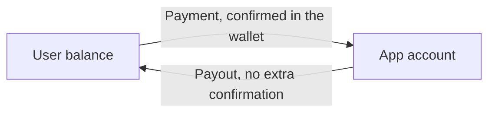
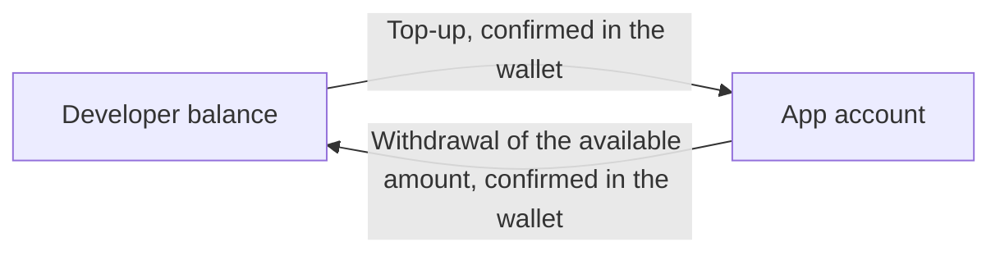
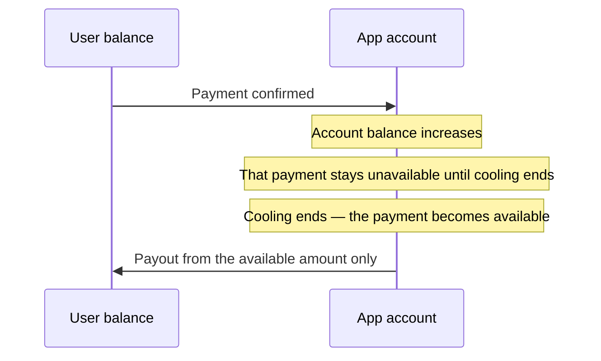

# @antarctic-wallet/aw-sdk

**English** · [Русский](./README.ru.md)

[](https://www.npmjs.com/package/@antarctic-wallet/aw-sdk)
[](./LICENSE)

SDK for embedded mini-apps in Antarctic Wallet (AW). It handles the secure
iframe-to-parent channel, the handshake, session and scope management, and
asking the wallet to show its **native** confirmation sheet for an operation.
It also reads the host environment (theme, language, safe area, visibility) and
calls host features: the QR scanner, haptics, and the page background color.

Zero runtime dependencies. Works in an iframe and in a React Native WebView.

## Runnable examples

Full end-to-end starters (frontend + partner backend + Docker) live in a separate repo:

| Stack | Example |
| ----- | ------- |
| Vue 3 | [examples/vue](https://github.com/antarctic-tech/example-app/tree/master/examples/vue) |
| React | [examples/react](https://github.com/antarctic-tech/example-app/tree/master/examples/react) |
| Angular | [examples/angular](https://github.com/antarctic-tech/example-app/tree/master/examples/angular) |
| Backend (Node) | [examples/backend-node](https://github.com/antarctic-tech/example-app/tree/master/examples/backend-node) |

- Repository: **[antarctic-tech/example-app](https://github.com/antarctic-tech/example-app)**
- Machine-readable spec for AI coding tools: [AGENTS.md](https://github.com/antarctic-tech/example-app/blob/master/AGENTS.md)

If you are starting from scratch, copy one scenario file from an example rather
than assembling the flow from this README.

## How the pieces fit

Three parties. Do not merge them.

```
Wallet (AW)            Mini app (browser)        YOUR backend
───────────            ──────────────────        ────────────
iframe + native UI     your frontend + SDK       app secret, sessions
confirmation sheet     postMessage to wallet     calls to the AW API
```

1. The wallet opens your frontend in an iframe and passes `?parentOrigin=`.
2. The frontend creates an `AWSDK` and calls `init()`.
3. **Your backend** creates the operation (`POST {AW_API_BASE}/api/apps/v1/intents`)
   with the app secret. The browser never sees that secret.
4. The frontend only asks the wallet to confirm the resulting id:
   `sdk.operations.requestConfirmation(operationId)`.

## Install

```bash
npm install @antarctic-wallet/aw-sdk
```

## Quick start

```typescript
import { AWSDK, AWScope } from '@antarctic-wallet/aw-sdk';

const sdk = new AWSDK({
  appId: 'my-mini-app',              // the `id` from your mini-app config.json
  scopes: [AWScope.USER_DATA, AWScope.PAY],
  parentOrigin: resolveParentOrigin(),
  persistSession: true,
});

// Subscribe BEFORE init() — `sdk.ready` fires during it.
sdk.events.on('sdk.ready', (session) => {
  console.log('granted scopes:', session.grantedScopes);
  console.log('idToken:', sdk.idToken); // signed JWT — forward to YOUR backend
});

sdk.events.on('sdk.error', ({ code, message }) => {
  console.error('SDK is dead:', code, message);
});

await sdk.init();

// on unmount / beforeunload
sdk.destroy();
```

## Configuration

```typescript
interface AWSDKConfig {
  /** Mini-app id issued by AW (same value as `id` in config.json) */
  appId: string;
  /** Scopes requested at handshake time */
  scopes: string[];
  /** Expected wallet origin — postMessage is never sent anywhere else */
  parentOrigin: string;
  /** Debug logging. Default: false */
  debug?: boolean;
  /** postMessage response timeout in ms. Default: 30000 */
  timeout?: number;
  /** Keep the session in sessionStorage and restore it on reload. Default: true */
  persistSession?: boolean;
  /** Retry policy for timed-out requests. Default: { maxAttempts: 3, baseDelay: 1000 } */
  retry?: { maxAttempts?: number; baseDelay?: number };
}
```

`retry` applies to the handshake, session refresh and scope calls. It is
deliberately **not** applied to `requestConfirmation`, which waits for a human.

### `parentOrigin`

`parentOrigin` is a security boundary: the SDK posts messages to that origin and
ignores messages from anywhere else. Never hardcode a single value — resolve it
in this order:

```typescript
function resolveParentOrigin(): string {
  const fromQuery = new URLSearchParams(location.search).get('parentOrigin');
  if (fromQuery) return fromQuery;
  if (document.referrer) return new URL(document.referrer).origin;
  return 'https://your-dev-wallet.example';   // dev fallback only
}
```

The wallet always passes `?parentOrigin=` and the launch environment
(`awPlatform`, `awColorScheme`, `awLanguageCode`). If you use a router, prefer a
hash router (`#/pay`) so the query string survives navigation.

### Is the app running inside the wallet?

```typescript
if (!AWSDK.isInsideWallet()) {
  // opened directly in a browser tab — show a "open me in Antarctic Wallet" screen
}
```

Returns `true` inside an iframe or a React Native WebView.

## Scopes

```typescript
import { AWScope } from '@antarctic-wallet/aw-sdk';

AWScope.USER_DATA  // 'userData' — profile + KYC flags in the id_token
AWScope.BALANCE    // 'balance'  — the user's balance
AWScope.PAY        // 'pay'      — the user pays you
```

`receive` is **not** a scope: it is an intent type (you paying the user), and it
requires no scope at all. Asking for `pay` does not enable payouts, and payouts
do not need the user to grant anything.

```typescript
const granted = await sdk.scopes.getScopes();          // string[]
const data = await sdk.scopes.getData<MyScopeData>();  // scope payload from the host
```

The scopes you pass to `new AWSDK({ scopes })` are what the handshake requests.
The `requiredScopes` field in your mini-app `config.json` is a manifest for the
wallet catalogue — it is **not** read by the SDK.

To ask for more scopes later, create a `scopes` intent on your backend and
confirm it like any other operation; the SDK emits `scopes.granted` afterwards.

## Authenticating the user (OIDC `id_token`)

`sdk.idToken` is a signed JWT whose `sub` is an opaque per-app login. It is the
**only** value that may authenticate the user on your backend. `sdk.user` /
`session.userContext` is decoded from that token inside the mini-app *without*
verifying the signature — treat it as UI-only data (`displayName` is the `sub`
on purpose, not a personal name).

```typescript
// In the mini-app — forward the token to your own backend:
await fetch('/api/auth/session', {
  method: 'POST',
  headers: { 'Content-Type': 'application/json' },
  body: JSON.stringify({ idToken: sdk.idToken }),
});
```

```typescript
// On YOUR backend — verify the signature against the host JWKS, then trust `sub`:
import { createRemoteJWKSet, jwtVerify } from 'jose';

const jwks = createRemoteJWKSet(new URL(`${AW_API_BASE}/api/v2/sdk/jwks`));
const { payload } = await jwtVerify(idToken, jwks, {
  issuer: 'aw',
  audience: AW_APP_ID,
});
const userId = payload.sub; // trusted — cannot be forged without AW's private key
```

`idToken` may be `null` while the session is still pending (no granted scopes
yet) or when an older host has not issued one — always null-check before use.
It rotates with the session (TTL ~600s); read the fresh value from `sdk.idToken`
or from the `session.refreshed` event.

## Operations (pay / receive / scopes)

The mini-app **never** creates an operation itself. Your backend does, with the
app secret, and the frontend only asks the wallet to confirm the returned id.

```
Mini app                    YOUR backend                     AW
   │  idToken + amount          │                             │
   │ ─────────────────────────► │  POST /api/apps/v1/intents  │
   │                            │ ──────────────────────────► │
   │       { operationId }      │                             │
   │ ◄───────────────────────── │                             │
   │
   │  sdk.operations.requestConfirmation(operationId)
   ▼
Wallet shows its native sheet: the user confirms or rejects
```

| Type | Meaning | Confirmation |
| ---- | ------- | ------------ |
| `pay` | The user pays you (purchase, donation) | Yes — native sheet in the wallet |
| `receive` | You pay the user (refund, payout). Not a scope, and needs none | No — already executed in the API response |
| `scopes` | Ask for additional permissions | Yes — native sheet in the wallet |

```typescript
// 1. Your backend creates the intent and returns its id
const { operationId, status } = await fetch('/api/intents', {
  method: 'POST',
  headers: { 'Content-Type': 'application/json' },
  body: JSON.stringify({ idToken: sdk.idToken, type: 'pay', amount: '5.00' }),
}).then((r) => r.json());

// 2. `receive` is already done; `pay` and `scopes` need the wallet sheet
if (status === 'pending') {
  const result = await sdk.operations.requestConfirmation(operationId);
  // result: { operationId, status, txId? }
}
```

`AWOperationStatus` is `'pending' | 'awaiting_confirmation' | 'confirmed' |
'succeeded' | 'failed' | 'rejected'`. A user rejection is delivered **as a
thrown `AWOperationError`** with `errorCode === 'user_rejected'`, and also as
the `operation.rejected` event.

In production, settle the order from the AW webhook (`intent.approved`,
`intent.rejected`, `payment.succeeded`, `payment.failed`) — not from what the
browser tab reported. The tab can be closed mid-flow. See the
[backend example](https://github.com/antarctic-tech/example-app/tree/master/examples/backend-node)
for signature verification and idempotency.

Where the money goes — the app account, the cooling period, top-up and
withdrawal — is in [Money flow](#money-flow).

> **Removed in 0.4.0:** `sdk.operations.prepare()`. Creating an operation from
> the browser was never safe, and the wallet-side flow requires a server-created
> intent. See [Migration](#migrating-from-03x).

<a id="money-flow"></a>

## Money flow

Each mini-app has one account: its own balance, kept apart from the developer's
personal balance. The API returns that balance in different currencies. For now
the response includes only USD.

A `scopes` intent does not move funds.

### The user and the app account



#### Payment — the user pays the app

Money moves from the user's balance to the app account. Your backend creates
a `pay` intent; the wallet asks the user to confirm, and the transfer happens
only after the user confirms. Transfers require the `pay` scope.

The amount moved from the user's balance to the app account is held on the app
account for the cooling period. It is already on the account, but those funds
cannot yet be used for a payout or a withdrawal to the developer's account.

#### Payout — the app pays the user

Money moves from the app account to the user's balance. Your backend creates
a `receive` intent. There is no confirmation sheet: when the API responds, the
transfer is already done.

Only the **available** amount on the app account can be paid out.

### The developer and the app account



#### Top-up — the developer funds the app account

The developer transfers money from their personal balance to the app account
and confirms the transfer in the wallet. The cooling period does not apply to
this deposit: the amount is available for the app to use as soon as it is
credited. That is how you fund payouts while payments from users are still
cooling.

#### Withdrawal — the developer takes money out

The developer can withdraw only the **available** amount, and only back to
their own balance. The withdrawal is confirmed in the wallet. A withdrawal to
someone else's balance is not possible.

### Cooling period

The cooling period applies only to payments from users. It does not apply to
deposits the developer makes into the app account.



| Funds in the app account | Available to pay out or withdraw |
| --- | --- |
| User payment still cooling | No |
| User payment after the cooling period | Yes |
| Developer deposit | Yes, immediately |

The available amount is the app account balance minus user payments that are
still cooling. Payouts and withdrawals both use only this amount.

### App account balance

Your backend reads the app account over the same server-to-server auth as
intents: header `X-AW-App-Id` and `Authorization: Bearer <app_secret>`. The
authenticated app is the account. The call does not use the user, a user login,
or the `balance` scope — that scope is the user's own balance.

```
GET {AW_API_BASE}/api/apps/v1/balance
```

The response is an array, one element per currency. For now it contains a single
element, USD. The next currency is another element of the same array; the
response shape does not change.

The account holds 100 USD, of which 30 are on hold and 70 are available:

```json
[
  {
    "asset": "USD",
    "total": { "amount": 100, "scale": 0 },
    "available": { "amount": 70, "scale": 0 },
    "locked": { "amount": 30, "scale": 0 }
  }
]
```

| Field | Meaning |
| --- | --- |
| `asset` | Currency. Only `USD` for now |
| `total` | App account balance in this currency |
| `locked` | Amount on hold for this account |
| `available` | `max(total − locked, 0)` |

Amounts are `{ amount, scale }`: 100 whole units is `{ "amount": 100, "scale": 0 }`.
`available` and `locked` are the same numbers as the available amount and the
cooling hold above.

### App status

| Status | Users can pay the app | App can pay users | Developer can top up | Developer can withdraw |
| --- | --- | --- | --- | --- |
| Active | Yes | Yes, from the available amount | Yes | Yes, the available amount, own balance only |
| Suspended | Yes | No | Yes | No |
| Blocked | No | No | No | No |

Suspension stops payouts and withdrawals. The app can still accept user
payments, and the developer can still top the app account up.

## Session management

The session auto-refreshes 60 seconds before it expires. Manual control:

```typescript
const session = sdk.getSession();     // AWSession | null

const status = await sdk.status();
// { status: 'active' | 'expired' | 'revoked', idToken, grantedScopes, expiresAt }

await sdk.refreshSession();           // emits 'session.refreshed'
```

With `persistSession: true` (the default) the session is stored in
`sessionStorage` under a per-`appId` key and restored on reload without a full
handshake. `destroy()` clears that entry — it is a teardown, not a pause.

## Back button

Control the host container's back button. When shown, the host header swaps
"Close" for a back arrow. Pressing it only delivers an event to your app:
navigation stays entirely on your side and the container stays open.

```typescript
sdk.backButton.show();      // header shows the back arrow
sdk.backButton.hide();      // header returns to "Close"
sdk.backButton.isVisible;   // boolean

const handler = () => router.back();
sdk.backButton.onClick(handler);
sdk.backButton.offClick(handler);
```

On Android the hardware back button follows the same contract while the arrow is
visible. `show()` and `hide()` before `init()` are remembered and sent once the
channel is open (after the handshake, or after a restored session). A retried
handshake resends the arrow if it should stay visible. `destroy()` hides the
arrow and drops every handler.

## Host Environment

Theme, language, platform, safe area and visibility of the host container.
Platform, theme and language are known before `init()`; safe area and visibility
are filled in by the time `await sdk.init()` returns. Events fire on every change
afterwards. An older wallet that sends no snapshot does not block `init()` and does
not emit `sdk.error`: launch values stay as they were, safe area stays unset, and
`isActive` stays `true`.

### Launch query

Read as soon as `new AWSDK()` returns, before any postMessage:

```
?awPlatform=ios&awColorScheme=dark&awLanguageCode=pt-BR
```

| Parameter | Property | Values |
| --- | --- | --- |
| `awPlatform` | `platform` | `web`, `tma`, `ios`, `android` |
| `awColorScheme` | `colorScheme` | `light`, `dark` — a system setting is already resolved |
| `awLanguageCode` | `languageCode` | BCP 47: `ru`, `en`, `kk`, `pt-BR`, … |

Unknown values are ignored. Safe area and visibility are not in the URL. `isActive`
starts as `true` and stays that way if the host never sends visibility. Keep these
parameters across navigations the same way as `parentOrigin`.

### Properties

| Property | Event | Meaning |
|---|---|---|
| `platform` | — | `web`, `tma`, `ios`, `android` |
| `colorScheme` | `themeChanged` | `light` / `dark`, system mode already resolved |
| `languageCode` | `languageChanged` | wallet UI language, BCP 47: `ru`, `en`, `kk`, `pt-BR`, … |
| `safeAreaInset` | `safeAreaChanged` | `{ top, right, bottom, left }` inside the container |
| `isActive` | `activated`, `deactivated` | the app is on screen and the wallet is in the foreground |

Properties are updated **before** handlers run, handlers take no arguments, and identical
values do not fire events again. `sdk.refreshEnvironment()` asks again for theme, language
and safe area only — visibility is push-only, and an older wallet ignores the requests.
Normally you do not need it: the host sends a full snapshot before `init()` resolves, then
only changes.

### CSS variables

The SDK sets them on `:root`:

```css
.footer { padding-bottom: var(--aw-safe-area-inset-bottom, 0px); }
.header { padding-top: var(--aw-safe-area-inset-top, 0px); }
```

`--aw-safe-area-inset-top|right|bottom|left`, `--aw-color-scheme`. A variable is absent until its value arrives — always provide a fallback.

### Example

```typescript
const sdk = new AWSDK({ appId: 'my-mini-app', scopes: [], parentOrigin: walletOrigin });

const applyEnvironment = () => {
  document.documentElement.dataset.theme = sdk.colorScheme ?? 'light';
  i18n.locale = sdk.languageCode ?? 'en';
};

applyEnvironment();
sdk.events.on('themeChanged', applyEnvironment);
sdk.events.on('languageChanged', applyEnvironment);
sdk.events.on('deactivated', () => pausePolling());
sdk.events.on('activated', () => refreshAndResumePolling());

await sdk.init();
if (!sdk.isActive) pausePolling();
```

### Vue 3 refs

`useAWSdk` returns readonly refs: `platform`, `isActive`, `colorScheme`, `languageCode`,
`safeAreaInset`. They update reactively after mount:

```typescript
import { watch } from 'vue';
import { useAWSdk } from '@antarctic-wallet/aw-sdk/vue';

const { colorScheme, languageCode, isActive } = useAWSdk(config);
watch(colorScheme, value => applyTheme(value ?? 'light'), { immediate: true });
watch(languageCode, value => applyLanguage(value ?? 'en'), { immediate: true });
watch(isActive, value => (value ? resume() : pause()));
```

## QR scanner

Opens the wallet's own scanner over the app and resolves with the decoded string.
The camera stays with the wallet: the app never sees the video, only the result.
The scanner shows which app will receive the result and closes after the first scan.

```typescript
try {
  const address = await sdk.scanQr();
} catch (err) {
  if (err instanceof AWScanQrError && err.errorCode === ScanQrErrorCodes.Closed) {
    // the user closed the scanner
  }
}
```

`AWScanQrError.errorCode`: `closed`, `not_active` (the app is minimized or the wallet is in
the background), `already_open`, `camera_denied`, `unsupported` (the host did not advertise
the scanner — see `sdk.isCommandAvailable(AWCommand.OpenScanQr)`), `generic_error`.

There is no caption argument: the wallet draws “the result goes to this app” itself.
The `timeout` from the config does not apply. The call waits until a result, a close, or
`destroy()`, which rejects a scan that is still open.

## Haptic feedback

Vibrates through the wallet, the same way native wallet controls do. Fire-and-forget:
no reply, and nothing happens while the app is minimized or the user has turned
vibration off in the wallet settings.

```typescript
sdk.hapticFeedback.impactOccurred('light');        // light | medium | heavy | rigid | soft
sdk.hapticFeedback.notificationOccurred('success'); // success | warning | error
sdk.hapticFeedback.selectionChanged();
```

## Background color

Tell the wallet which color sits under your page. The wallet paints only the WebView /
iframe area, so iOS overscroll no longer flashes the wallet tone. The header and the
loader stay in the wallet's own color. Accepts `#rgb` or `#rrggbb`; a short form is
expanded to lowercase `#rrggbb` and that is what `sdk.backgroundColor` returns. Anything
else returns `false` and is not sent. No reply; older wallets ignore the call.

```typescript
sdk.setBackgroundColor('#0f1117');
sdk.backgroundColor; // '#0f1117'
```

Call it again whenever your theme changes, e.g. on `themeChanged`.

## Events

Subscribe **before** `init()`.

| Event | Payload | When |
| ----- | ------- | ---- |
| `sdk.ready` | `AWSession` | Handshake finished (or a stored session was restored) |
| `sdk.error` | `{ code, message }` | Unsolicited host error: bad origin, host unreachable, `init` failed. An `ERROR` that answers a request rejects that call and does not emit `sdk.error` |
| `scopes.granted` | `{ scopes }` | Emitted with the granted set on ready, and after a `scopes` operation |
| `session.refreshed` | `{ sessionToken, idToken, expiresAt }` | Session rotated — take the fresh `idToken` |
| `session.expired` | — | Session is dead; reset UI and `init()` again |
| `operation.rejected` | `{ operationId, reason }` | The user tapped "reject" in the wallet |
| `backButton` | — | The host's back arrow was pressed |
| `themeChanged` | — | `sdk.colorScheme` changed |
| `languageChanged` | — | `sdk.languageCode` changed |
| `safeAreaChanged` | — | `sdk.safeAreaInset` changed |
| `activated` / `deactivated` | — | The app went on / off screen (`sdk.isActive`) |

```typescript
sdk.events.on('session.refreshed', ({ idToken }) => {
  /* if you cached idToken, replace it */
});
sdk.events.on('session.expired', () => {
  /* reset UI, call sdk.init() again */
});
```

## Error handling

Every error extends `AWSDKError`. Match with `instanceof`, not on `message`.

| Class | When | Extra fields |
| ----- | ---- | ------------ |
| `AWInitError` | `init()` failed: handshake, config, rejected scopes, timeout | `errorCode: InitErrorCodes` |
| `AWSessionError` | Session invalid, expired or revoked | `errorCode: SessionErrorCodes` |
| `AWScopeError` | A required scope was not granted | `errorCode: ScopeErrorCodes` |
| `AWOperationError` | Operation failed or was rejected | `operationId`, `errorCode: OperationErrorCodes` |
| `AWTimeoutError` | No response within `timeout` | — |
| `AWScanQrError` | QR scanner failed, was closed, or is unavailable | `errorCode: ScanQrErrorCodes` |

```typescript
import {
  AWInitError,
  AWOperationError,
  AWTimeoutError,
  InitErrorCodes,
  OperationErrorCodes,
} from '@antarctic-wallet/aw-sdk';

try {
  await sdk.init();
} catch (error) {
  if (error instanceof AWInitError) {
    if (error.errorCode === InitErrorCodes.ScopesRejected) {
      /* the user declined the permission sheet */
    }
  } else if (error instanceof AWTimeoutError) {
    /* the wallet did not answer */
  } else throw error;
}

try {
  await sdk.operations.requestConfirmation(operationId);
} catch (error) {
  if (error instanceof AWOperationError) {
    if (error.errorCode === OperationErrorCodes.UserRejected) {
      /* not a failure — the user said no */
    }
  }
}
```

The code enums (`InitErrorCodes`, `SessionErrorCodes`, `ScopeErrorCodes`,
`OperationErrorCodes`, `ScanQrErrorCodes`) and their default English messages
(`InitErrorMessage`, …) are exported too.

## Vue 3

A composable ships in a separate entry point. `vue` is an optional peer
dependency — installing it is only needed if you import this path.

```vue
<script setup lang="ts">
import { useAWSdk } from '@antarctic-wallet/aw-sdk/vue';
import { AWScope } from '@antarctic-wallet/aw-sdk';

const { sdk, session, user, isReady, error } = useAWSdk({
  appId: 'my-mini-app',
  scopes: [AWScope.USER_DATA, AWScope.PAY],
  parentOrigin: resolveParentOrigin(),
});
</script>
```

It creates the SDK on mount, calls `init()`, and calls `destroy()` on unmount.
`sdk` is a `shallowRef` — never put the SDK instance into deep reactive state.
The same composable also returns the environment refs: `platform`, `colorScheme`,
`languageCode`, `safeAreaInset`, `isActive`. See [Host environment](#host-environment).

## Host compatibility

Wallet versions roll out gradually, so a host may not support every command your
SDK version knows about.

```typescript
import {
  AWCommand,
  COMMAND_VERSIONS,
  PROTOCOL_VERSION,
  SDK_VERSION,
} from '@antarctic-wallet/aw-sdk';

await sdk.init();

if (!sdk.isCommandAvailable(AWCommand.GetScopesData)) {
  // this host is older — hide the feature instead of failing
}
```

- `sdk.isCommandAvailable(command)` — checks the `supportedCommands` map the
  host returned during the handshake. If the host reported nothing, required
  commands are assumed available. Optional ones are not: `scanQr()` needs an
  explicit `web_app_open_scan_qr` entry, otherwise it throws `unsupported`.
  Theme, language and safe area count as available once a snapshot has arrived,
  even if they are missing from the map. Haptics and background color are
  fire-and-forget: an older wallet ignores them, and `init()` still succeeds.
- `COMMAND_VERSIONS` — minimum command versions this SDK build requires.
- `PROTOCOL_VERSION` — postMessage envelope version (`'1.0'`).
- `SDK_VERSION` — always equal to the package version.

## Cleanup

```typescript
sdk.destroy();
```

Stops auto-refresh, rejects in-flight requests and clears their timers (an open
scanner does not keep waiting), tears down the postMessage transport, removes
all listeners, hides the back arrow, drops the background color and the `--aw-*`
CSS variables, and clears the persisted session. Call it from `onUnmounted` /
`useEffect` cleanup / `ngOnDestroy`.

## Migrating from 0.3.x

`0.4.0` aligns the SDK with the flow the wallet and the examples actually use.

- **Removed `sdk.operations.prepare()`** along with `AWOperationIntent`,
  `AWOperationIntentParams` and the `PREPARE_OPERATION` protocol messages.
  Create the intent on your backend and pass the resulting `operationId` to
  `sdk.operations.requestConfirmation()`.
- **`AWOperationType` is now `'pay' | 'receive' | 'scopes'`** (was
  `'transfer' | 'payment'`).
- **`AWScope` values changed** to the ones the wallet actually grants:
  `USER_DATA` (`'userData'`), `BALANCE` (`'balance'`)
  and `PAY` (`'pay'`). The old `user.profile.read` / `accounts.read` /
  `accounts.balances.read` / `transfers.create` / `payments.create` members are
  gone. `receive` is deliberately absent — it is an intent type that requires
  no scope at all.
- **`AWCommand.PrepareOperation` removed** from `AWCommand` and
  `COMMAND_VERSIONS`.
- Previous READMEs documented an `operation.succeeded` event. It never existed
  in `AWSDKEventMap` — use the value returned by `requestConfirmation()` and, in
  production, the AW webhook.

## License

MIT — see [LICENSE](./LICENSE).
