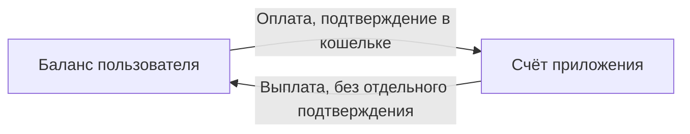
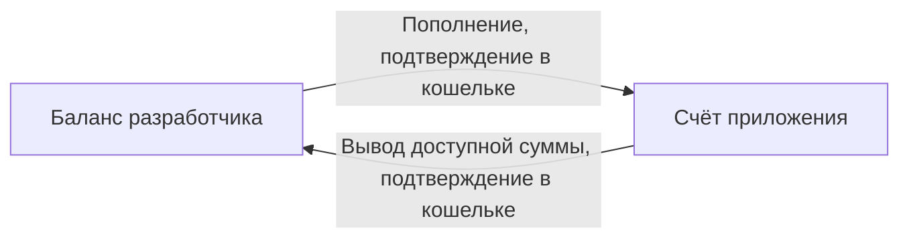
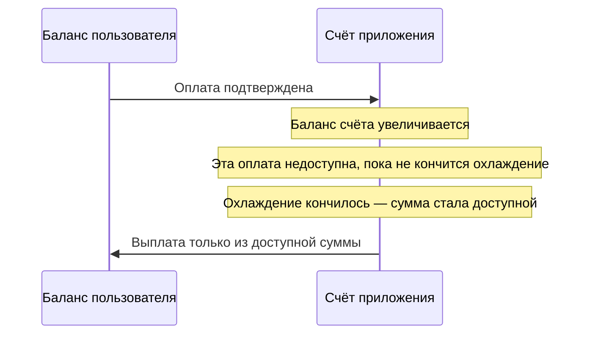

# @antarctic-wallet/aw-sdk

[English](./README.md) · **Русский**


SDK для встроенных мини-приложений Antarctic Wallet (AW). Берёт на себя
безопасный канал iframe ↔ кошелёк, хендшейк, сессию и скоупы, а также запрос
**нативного** листа подтверждения операции в кошельке. Читает окружение хоста
(тема, язык, safe area, видимость) и вызывает его возможности: QR-сканер,
тактильный отклик и цвет фона страницы.

Без рантайм-зависимостей. Работает в iframe и в React Native WebView.

## Рабочие примеры

Готовые сквозные стартеры (фронт + бэкенд партнёра + Docker) лежат в отдельном репозитории:


| Стек          | Пример                                                                                                   |
| ------------- | -------------------------------------------------------------------------------------------------------- |
| Vue 3         | [examples/vue](https://github.com/antarctic-tech/example-app/tree/master/examples/vue)                   |
| React         | [examples/react](https://github.com/antarctic-tech/example-app/tree/master/examples/react)               |
| Angular       | [examples/angular](https://github.com/antarctic-tech/example-app/tree/master/examples/angular)           |
| Бэкенд (Node) | [examples/backend-node](https://github.com/antarctic-tech/example-app/tree/master/examples/backend-node) |


- Репозиторий: **[antarctic-tech/example-app](https://github.com/antarctic-tech/example-app)**
- Машиночитаемая спека для ИИ-инструментов: [AGENTS.md](https://github.com/antarctic-tech/example-app/blob/master/AGENTS.md)

Если начинаете с нуля — скопируйте файл сценария из примера, а не собирайте
поток по этому README.

## Как это устроено

Три стороны. Их нельзя смешивать.

```
Кошелёк (AW)           Мини-апка (браузер)       Ваш бэкенд
────────────           ───────────────────       ──────────
iframe + нативный UI   ваш фронт + SDK           секрет, сессии
лист подтверждения     postMessage в кошелёк     вызовы API AW
```

1. Кошелёк открывает ваш фронт в iframe и передаёт `?parentOrigin=`.
2. Фронт создаёт `AWSDK` и вызывает `init()`.
3. Операцию создаёт **ваш бэкенд** (`POST {AW_API_BASE}/api/apps/v1/intents`)
  с секретом приложения. Браузер секрет не видит.
4. Фронт только просит кошелёк подтвердить полученный id:
  `sdk.operations.requestConfirmation(operationId)`.

## Установка

```bash
npm install @antarctic-wallet/aw-sdk
```

## Быстрый старт

```typescript
import { AWSDK, AWScope } from '@antarctic-wallet/aw-sdk';

const sdk = new AWSDK({
  appId: 'my-mini-app',              // поле `id` из config.json мини-апки
  scopes: [AWScope.USER_DATA, AWScope.PAY],
  parentOrigin: resolveParentOrigin(),
  persistSession: true,
});

// Подписываемся ДО init() — событие `sdk.ready` летит внутри него.
sdk.events.on('sdk.ready', (session) => {
  console.log('выданные скоупы:', session.grantedScopes);
  console.log('idToken:', sdk.idToken); // подписанный JWT — шлём на СВОЙ бэкенд
});

sdk.events.on('sdk.error', ({ code, message }) => {
  console.error('SDK дальше не работает:', code, message);
});

await sdk.init();

// в onUnmounted / beforeunload
sdk.destroy();
```

## Конфигурация

```typescript
interface AWSDKConfig {
  /** Идентификатор мини-апки из кабинета AW (то же, что `id` в config.json) */
  appId: string;
  /** Скоупы, запрашиваемые при хендшейке */
  scopes: string[];
  /** Ожидаемый origin кошелька — postMessage не уйдёт никуда больше */
  parentOrigin: string;
  /** Отладочные логи. По умолчанию false */
  debug?: boolean;
  /** Таймаут ответа postMessage, мс. По умолчанию 30000 */
  timeout?: number;
  /** Хранить сессию в sessionStorage и восстанавливать при перезагрузке. По умолчанию true */
  persistSession?: boolean;
  /** Политика ретраев при таймаутах. По умолчанию { maxAttempts: 3, baseDelay: 1000 } */
  retry?: { maxAttempts?: number; baseDelay?: number };
}
```

`retry` работает для хендшейка, обновления сессии и запросов скоупов. К
`requestConfirmation` он намеренно **не** применяется — там ждём человека.

### `parentOrigin`

`parentOrigin` — это граница безопасности: SDK шлёт сообщения только на этот
origin и игнорирует всё, что пришло с других. Никогда не зашивайте одно
значение — определяйте по порядку:

```typescript
function resolveParentOrigin(): string {
  const fromQuery = new URLSearchParams(location.search).get('parentOrigin');
  if (fromQuery) return fromQuery;
  if (document.referrer) return new URL(document.referrer).origin;
  return 'https://your-dev-wallet.example';   // только для локальной разработки
}
```

Кошелёк всегда передаёт `?parentOrigin=` и параметры запуска
(`awPlatform`, `awColorScheme`, `awLanguageCode`). Если используете роутер —
берите хеш-роутер (`#/pay`), чтобы query-строка пережила навигацию.

### Запущены ли мы внутри кошелька

```typescript
if (!AWSDK.isInsideWallet()) {
  // открыли просто во вкладке — покажите экран «откройте в Antarctic Wallet»
}
```

Возвращает `true` внутри iframe и в React Native WebView.

## Скоупы

```typescript
import { AWScope } from '@antarctic-wallet/aw-sdk';

AWScope.USER_DATA  // 'userData' — профиль и KYC-флаги в id_token
AWScope.BALANCE    // 'balance'  — баланс пользователя
AWScope.PAY        // 'pay'      — пользователь платит вам
```

`receive` скоупом **не является**: это тип интента (выплата пользователю), и он
не требует вообще никакого скоупа. Запрошенный `pay` выплаты не включает, а сами
выплаты не требуют от пользователя ничего выдавать.

```typescript
const granted = await sdk.scopes.getScopes();          // string[]
const data = await sdk.scopes.getData<MyScopeData>();  // данные скоупов от хоста
```

Скоупы из `new AWSDK({ scopes })` — это то, что запрашивает хендшейк. Поле
`requiredScopes` в `config.json` мини-апки — манифест для каталога кошелька,
SDK его **не читает**.

Чтобы запросить дополнительные разрешения позже, создайте на бэкенде интент
типа `scopes` и подтвердите его как обычную операцию — после этого SDK
эмитит `scopes.granted`.

## Кто пользователь (OIDC `id_token`)

`sdk.idToken` — подписанный JWT, в котором `sub` это непрозрачный логин
пользователя **в вашем приложении**. Только он годится для авторизации на
бэкенде. `sdk.user` / `session.userContext` декодируется из этого токена внутри
мини-апки *без проверки подписи* — это данные только для экрана (`displayName`
намеренно равен `sub`, а не имени человека).

```typescript
// В мини-апке — форвардим токен на свой бэкенд:
await fetch('/api/auth/session', {
  method: 'POST',
  headers: { 'Content-Type': 'application/json' },
  body: JSON.stringify({ idToken: sdk.idToken }),
});
```

```typescript
// На ВАШЕМ бэкенде — проверяем подпись через JWKS хоста и доверяем `sub`:
import { createRemoteJWKSet, jwtVerify } from 'jose';

const jwks = createRemoteJWKSet(new URL(`${AW_API_BASE}/api/v2/sdk/jwks`));
const { payload } = await jwtVerify(idToken, jwks, {
  issuer: 'aw',
  audience: AW_APP_ID,
});
const userId = payload.sub; // доверенный — подделать без ключа AW нельзя
```

`idToken` может быть `null`, пока сессия в состоянии pending (скоупы ещё не
выданы) или если хост старой версии его не выпустил — всегда проверяйте на
null. Токен ротируется вместе с сессией (TTL ~600 с); свежее значение берите из
`sdk.idToken` или из события `session.refreshed`.

## Операции (pay / receive / scopes)

Мини-апка **никогда** не создаёт операцию сама. Это делает ваш бэкенд с
секретом приложения, а фронт лишь просит кошелёк подтвердить полученный id.

```
Мини-апка                   Ваш бэкенд                       AW
   │  idToken + сумма           │                             │
   │ ─────────────────────────► │  POST /api/apps/v1/intents  │
   │                            │ ──────────────────────────► │
   │       { operationId }      │                             │
   │ ◄───────────────────────── │                             │
   │
   │  sdk.operations.requestConfirmation(operationId)
   ▼
Кошелёк показывает нативный лист: пользователь подтверждает или отклоняет
```


| Тип       | Смысл                                                                    | Подтверждение                    |
| --------- | ------------------------------------------------------------------------ | -------------------------------- |
| `pay`     | Пользователь платит вам (покупка, донат)                                 | Да — нативный лист в кошельке    |
| `receive` | Вы платите пользователю (возврат, выплата). Не скоуп и скоупа не требует | Нет — уже выполнено в ответе API |
| `scopes`  | Запросить дополнительные разрешения                                      | Да — нативный лист в кошельке    |


```typescript
// 1. Ваш бэкенд создаёт интент и возвращает его id
const { operationId, status } = await fetch('/api/intents', {
  method: 'POST',
  headers: { 'Content-Type': 'application/json' },
  body: JSON.stringify({ idToken: sdk.idToken, type: 'pay', amount: '5.00' }),
}).then((r) => r.json());

// 2. `receive` уже исполнен; `pay` и `scopes` требуют листа в кошельке
if (status === 'pending') {
  const result = await sdk.operations.requestConfirmation(operationId);
  // result: { operationId, status, txId? }
}
```

`AWOperationStatus` — это `'pending' | 'awaiting_confirmation' | 'confirmed' | 'succeeded' | 'failed' | 'rejected'`. Отказ пользователя приходит **брошенным
`AWOperationError**` с `errorCode === 'user_rejected'`, а также событием
`operation.rejected`.

В проде закрывайте заказ вебхуком от AW (`intent.approved`, `intent.rejected`,
`payment.succeeded`, `payment.failed`), а не тем, что ответила вкладка: её
могут закрыть на середине. Проверка подписи и идемпотентность — в
[примере бэкенда](https://github.com/antarctic-tech/example-app/tree/master/examples/backend-node).

Куда уходят деньги — счёт приложения, срок охлаждения, пополнение и вывод — в разделе
[Движение средств](#money-flow).

> **Удалено в 0.4.0:** `sdk.operations.prepare()`. Создавать операцию из
> браузера было небезопасно, а кошелёк всё равно ждёт интент, созданный
> сервером. См. [Миграцию](#миграция-с-03x).


## Движение средств

У каждого мини-приложения один счёт: собственный баланс, отдельно от личного баланса разработчика. По API этот баланс можно получить в разных валютах. Пока в ответе только USD.

Интент `scopes` не приводит к движению средств.

### Пользователь и счёт приложения




#### Оплата — пользователь платит приложению

Деньги идут с баланса пользователя на счёт приложения. Бэкенд создаёт интент
`pay`; кошелёк запрашивает у пользователя подтверждение, и перевод проходит только после подтверждения пользователем. Для переводов требуется scope `pay`.

Сумма, переведённая со счета пользователя на счет приложения, удерживается на счете приложения в течение периода охлаждения. Сумма уже на счёте, но сделать этими средствами выплату или вывод на счёт разработчика ещё нельзя.

#### Выплата — приложение платит пользователю

Деньги идут со счёта приложения на баланс пользователя. Бэкенд создаёт интент
`receive`. Отдельного подтверждения нет: к моменту ответа API перевод уже
выполнен.

Выплатить можно только **доступную** сумму со счета приложения.

### Разработчик и счёт приложения




#### Пополнение — разработчик пополняет счёт приложения

Разработчик переводит деньги со своего личного баланса на счёт приложения и подтверждает перевод в кошельке. Срок охлаждения на этот депозит не распространяется: сумма доступна для распоряжения приложением сразу после зачисления. Так можно финансировать выплаты, пока оплаты от пользователей ещё на охлаждении.

#### Вывод — разработчик забирает деньги

Разработчик может вывести только **доступную** сумму и только на свой собственный
баланс. Вывод подтверждается в кошельке. На чужой баланс вывести нельзя.

### Срок охлаждения

Срок охлаждения действует только на оплаты пользователя. На депозиты
разработчика на счёт приложения он не распространяется.




| Средства на счёте                            | Можно выплатить или вывести |
| -------------------------------------------- | --------------------------- |
| Оплата пользователя, охлаждение ещё идёт     | Нет                         |
| Оплата пользователя после периода охлаждения | Да                          |
| Депозит разработчика                         | Да, сразу                   |


Доступная сумма — это баланс счёта минус оплаты пользователя, которые ещё
охлаждаются. И выплаты, и вывод берутся только из неё.

### Баланс счёта приложения

Бэкенд читает счёт приложения той же server-to-server авторизацией, что и
интенты: заголовок `X-AW-App-Id` и `Authorization: Bearer <app_secret>`.
Аутентифицированное приложение и есть этот счёт. В вызове не участвуют
пользователь, его логин и scope `balance` — этот scope про баланс самого
пользователя.

```
GET {AW_API_BASE}/api/apps/v1/balance
```

Ответ — массив, по элементу на валюту. Пока в нём один элемент, USD. Следующая
валюта — ещё один элемент того же массива, форма ответа не меняется.

Казна 100 USD, из них 30 в холде и 70 доступно:

```json
[
  {
    "asset": "USD",
    "total": { "amount": 100, "scale": 0 },
    "available": { "amount": 70, "scale": 0 },
    "locked": { "amount": 30, "scale": 0 }
  }
]
```

| Поле | Смысл |
| --- | --- |
| `asset` | Валюта. Пока только `USD` |
| `total` | Баланс счёта приложения в этой валюте |
| `locked` | Сумма активного холда этого счёта |
| `available` | `max(total − locked, 0)` |

Суммы в виде `{ amount, scale }`: 100 целых — `{ "amount": 100, "scale": 0 }`.
`available` и `locked` — те же числа, что доступная сумма и холд на охлаждении
выше.

### Статус приложения


| Статус         | Пользователь может платить | Приложение может платить пользователю | Разработчик может пополнить | Разработчик может вывести                  |
| -------------- | -------------------------- | ------------------------------------- | --------------------------- | ------------------------------------------ |
| Активно        | Да                         | Да, из доступной суммы                | Да                          | Да, доступная сумма, только на свой баланс |
| Приостановлено | Да                         | Нет                                   | Да                          | Нет                                        |
| Заблокировано  | Нет                        | Нет                                   | Нет                         | Нет                                        |


Приостановка останавливает выплаты и вывод. Принимать оплаты пользователей
при этом можно, и разработчик по-прежнему может пополнить счёт.

## Сессия

Сессия сама обновляется за 60 секунд до истечения. Ручное управление:

```typescript
const session = sdk.getSession();     // AWSession | null

const status = await sdk.status();
// { status: 'active' | 'expired' | 'revoked', idToken, grantedScopes, expiresAt }

await sdk.refreshSession();           // эмитит 'session.refreshed'
```

При `persistSession: true` (по умолчанию) сессия лежит в `sessionStorage` под
ключом, привязанным к `appId`, и восстанавливается при перезагрузке без полного
хендшейка. `destroy()` эту запись стирает — это завершение работы, а не пауза.

## Кнопка «Назад»

Управление кнопкой «Назад» в chrome контейнера. Когда она показана, в шапке
хоста вместо «Закрыть» появляется стрелка. Нажатие только доставляет событие в
ваше приложение: навигация целиком на вашей стороне, контейнер не закрывается.

```typescript
sdk.backButton.show();      // в шапке появляется стрелка «Назад»
sdk.backButton.hide();      // шапка возвращается к «Закрыть»
sdk.backButton.isVisible;   // boolean

const handler = () => router.back();
sdk.backButton.onClick(handler);
sdk.backButton.offClick(handler);
```

На Android аппаратная кнопка «Назад» работает по тому же контракту, пока
стрелка видима. `show()` и `hide()` до `init()` запоминаются и уходят, когда
канал открыт (после хендшейка или после восстановленной сессии). Повторный
хендшейк снова отправляет стрелку, если она должна остаться видимой.
`destroy()` прячет стрелку и снимает все хендлеры.

## Окружение хоста

Тема, язык, платформа, safe-area и видимость контейнера приложения.
Платформа, тема и язык известны до `init()`; safe area и видимость заполнены к
моменту, когда `await sdk.init()` вернулся. Дальше события приходят при каждом
изменении. Старый кошелёк, который не присылает снимок, `init()` не блокирует и
`sdk.error` не эмитит: значения из URL остаются как были, safe area не заполняется,
`isActive` остаётся `true`.

### Параметры запуска

Читаются сразу после `new AWSDK()`, до любого postMessage:

```
?awPlatform=ios&awColorScheme=dark&awLanguageCode=pt-BR
```

| Параметр | Свойство | Значения |
| --- | --- | --- |
| `awPlatform` | `platform` | `web`, `tma`, `ios`, `android` |
| `awColorScheme` | `colorScheme` | `light`, `dark` — системная настройка уже применена |
| `awLanguageCode` | `languageCode` | BCP 47: `ru`, `en`, `kk`, `pt-BR`, … |

Неизвестные значения игнорируются. В URL нет safe area и видимости. `isActive`
стартует как `true` и таким и остаётся, если хост видимость не присылает. Эти
параметры нужно сохранять при навигации так же, как `parentOrigin`.

### Свойства

| Свойство | Событие | Что означает |
|---|---|---|
| `platform` | — | `web`, `tma`, `ios`, `android` |
| `colorScheme` | `themeChanged` | `light` / `dark`, системный режим уже применён |
| `languageCode` | `languageChanged` | язык интерфейса кошелька, BCP 47: `ru`, `en`, `kk`, `pt-BR`, … |
| `safeAreaInset` | `safeAreaChanged` | `{ top, right, bottom, left }` внутри контейнера |
| `isActive` | `activated`, `deactivated` | приложение на экране и кошелёк на переднем плане |

Свойства обновляются **до** вызова обработчиков, обработчики без аргументов, одинаковые
значения событий не вызывают. `sdk.refreshEnvironment()` повторно запрашивает только тему,
язык и safe area: видимость приходит только пушем, старый кошелёк запросы игнорирует.
Обычно вызов не нужен: хост шлёт полный снимок до резолва `init()`, дальше — только изменения.

### CSS-переменные

SDK выставляет их на `:root`:

```css
.footer { padding-bottom: var(--aw-safe-area-inset-bottom, 0px); }
.header { padding-top: var(--aw-safe-area-inset-top, 0px); }
```

`--aw-safe-area-inset-top|right|bottom|left`, `--aw-color-scheme`. Пока значение не пришло, переменной нет — задавайте fallback.

### Пример

```typescript
const sdk = new AWSDK({ appId: 'my-mini-app', scopes: [], parentOrigin: walletOrigin });

const applyEnvironment = () => {
  document.documentElement.dataset.theme = sdk.colorScheme ?? 'light';
  i18n.locale = sdk.languageCode ?? 'en';
};

applyEnvironment();
sdk.events.on('themeChanged', applyEnvironment);
sdk.events.on('languageChanged', applyEnvironment);
sdk.events.on('deactivated', () => pausePolling());
sdk.events.on('activated', () => refreshAndResumePolling());

await sdk.init();
if (!sdk.isActive) pausePolling();
```

### Vue 3 refs

`useAWSdk` возвращает readonly refs: `platform`, `isActive`, `colorScheme`, `languageCode`,
`safeAreaInset`. После mount они обновляются реактивно:

```typescript
import { watch } from 'vue';
import { useAWSdk } from '@antarctic-wallet/aw-sdk/vue';

const { colorScheme, languageCode, isActive } = useAWSdk(config);
watch(colorScheme, value => applyTheme(value ?? 'light'), { immediate: true });
watch(languageCode, value => applyLanguage(value ?? 'en'), { immediate: true });
watch(isActive, value => (value ? resume() : pause()));
```

## QR-сканер

Открывает сканер кошелька поверх приложения и возвращает распознанную строку.
Камера остаётся у кошелька: приложение не видит видео, только результат.
Сканер показывает, какое приложение получит результат, и закрывается после первого скана.

```typescript
try {
  const address = await sdk.scanQr();
} catch (err) {
  if (err instanceof AWScanQrError && err.errorCode === ScanQrErrorCodes.Closed) {
    // пользователь закрыл сканер
  }
}
```

`AWScanQrError.errorCode`: `closed`, `not_active` (приложение свёрнуто или кошелёк в фоне),
`already_open`, `camera_denied`, `unsupported` (хост не заявил сканер — см.
`sdk.isCommandAvailable(AWCommand.OpenScanQr)`), `generic_error`.

Аргумента с подписью нет: кошелёк сам рисует «результат получит это приложение».
`timeout` из конфига на сканер не действует. Вызов ждёт результат, закрытие или
`destroy()`, который отклоняет ещё открытый скан.

## Тактильный отклик

Вибрация через кошелёк, как у его собственных контролов. Без ответа; пока приложение
свёрнуто или вибрация выключена в настройках кошелька, ничего не происходит.

```typescript
sdk.hapticFeedback.impactOccurred('light');        // light | medium | heavy | rigid | soft
sdk.hapticFeedback.notificationOccurred('success'); // success | warning | error
sdk.hapticFeedback.selectionChanged();
```

## Цвет фона

Сообщите кошельку, какой цвет лежит под вашей страницей. Кошелёк красит только область
WebView / iframe, и оверскролл на iOS больше не мигает его тоном. Шапка и лоадер остаются
в цвете кошелька. Принимает `#rgb` или `#rrggbb`; короткая форма раскрывается в `#rrggbb`
в нижнем регистре — его и возвращает `sdk.backgroundColor`. Всё остальное даёт `false` и
не отправляется. Без ответа; старые кошельки вызов игнорируют.

```typescript
sdk.setBackgroundColor('#0f1117');
sdk.backgroundColor; // '#0f1117'
```

Вызывайте повторно при смене темы, например по `themeChanged`.

## События

Подписывайтесь **до** `init()`.

| Событие | Payload | Когда |
| ------- | ------- | ----- |
| `sdk.ready` | `AWSession` | Хендшейк прошёл (или восстановлена сохранённая сессия) |
| `sdk.error` | `{ code, message }` | Незапрошенная ошибка хоста: плохой origin, хост недоступен, `init` не удался. `ERROR` в ответ на запрос отклоняет этот вызов и `sdk.error` не эмитит |
| `scopes.granted` | `{ scopes }` | Летит с выданным набором при ready и после операции `scopes` |
| `session.refreshed` | `{ sessionToken, idToken, expiresAt }` | Сессия обновилась — возьмите свежий `idToken` |
| `session.expired` | — | Сессия мертва: сбросьте UI и вызовите `init()` заново |
| `operation.rejected` | `{ operationId, reason }` | В кошельке нажали «отклонить» |
| `backButton` | — | Нажата стрелка «Назад» в шапке хоста |
| `themeChanged` | — | Изменился `sdk.colorScheme` |
| `languageChanged` | — | Изменился `sdk.languageCode` |
| `safeAreaChanged` | — | Изменился `sdk.safeAreaInset` |
| `activated` / `deactivated` | — | Приложение появилось на экране / ушло с него (`sdk.isActive`) |

```typescript
sdk.events.on('session.refreshed', ({ idToken }) => {
  /* если кешировали idToken — замените */
});
sdk.events.on('session.expired', () => {
  /* сбросить UI, снова sdk.init() */
});
```

## Ошибки

Все ошибки наследуют `AWSDKError`. Ловите через `instanceof`, не по `message`.


| Класс              | Когда                                                             | Доп. поля                                       |
| ------------------ | ----------------------------------------------------------------- | ----------------------------------------------- |
| `AWInitError`      | `init()` не удался: хендшейк, конфиг, отклонённые скоупы, таймаут | `errorCode: InitErrorCodes`                     |
| `AWSessionError`   | Сессия недействительна, истекла или отозвана                      | `errorCode: SessionErrorCodes`                  |
| `AWScopeError`     | Нужный скоуп не выдан                                             | `errorCode: ScopeErrorCodes`                    |
| `AWOperationError` | Операция не прошла или отклонена                                  | `operationId`, `errorCode: OperationErrorCodes` |
| `AWTimeoutError`   | Ответа не было дольше `timeout`                                   | —                                               |
| `AWScanQrError`    | QR-сканер не открылся, закрыт или недоступен                      | `errorCode: ScanQrErrorCodes`                   |


```typescript
import {
  AWInitError,
  AWOperationError,
  AWTimeoutError,
  InitErrorCodes,
  OperationErrorCodes,
} from '@antarctic-wallet/aw-sdk';

try {
  await sdk.init();
} catch (error) {
  if (error instanceof AWInitError) {
    if (error.errorCode === InitErrorCodes.ScopesRejected) {
      /* пользователь отклонил лист разрешений */
    }
  } else if (error instanceof AWTimeoutError) {
    /* кошелёк не ответил */
  } else throw error;
}

try {
  await sdk.operations.requestConfirmation(operationId);
} catch (error) {
  if (error instanceof AWOperationError) {
    if (error.errorCode === OperationErrorCodes.UserRejected) {
      /* не сбой — пользователь отказался */
    }
  }
}
```

Enum'ы кодов (`InitErrorCodes`, `SessionErrorCodes`, `ScopeErrorCodes`,
`OperationErrorCodes`, `ScanQrErrorCodes`) и их дефолтные сообщения
(`InitErrorMessage`, …) тоже экспортируются.

## Vue 3

Composable лежит в отдельной точке входа. `vue` — опциональная peer-зависимость,
она нужна только если импортируете этот путь.

```vue
<script setup lang="ts">
import { useAWSdk } from '@antarctic-wallet/aw-sdk/vue';
import { AWScope } from '@antarctic-wallet/aw-sdk';

const { sdk, session, user, isReady, error } = useAWSdk({
  appId: 'my-mini-app',
  scopes: [AWScope.USER_DATA, AWScope.PAY],
  parentOrigin: resolveParentOrigin(),
});
</script>
```

Composable создаёт SDK при mount, вызывает `init()` и `destroy()` при unmount.
`sdk` — это `shallowRef`: инстанс SDK никогда не кладите в глубокую реактивность.
Тот же composable возвращает refs окружения: `platform`, `colorScheme`,
`languageCode`, `safeAreaInset`, `isActive`. См. [Окружение хоста](#окружение-хоста).

## Совместимость с хостом

Версии кошелька раскатываются постепенно, поэтому хост может не поддерживать
все команды, которые знает ваша версия SDK.

```typescript
import {
  AWCommand,
  COMMAND_VERSIONS,
  PROTOCOL_VERSION,
  SDK_VERSION,
} from '@antarctic-wallet/aw-sdk';

await sdk.init();

if (!sdk.isCommandAvailable(AWCommand.GetScopesData)) {
  // хост старее — спрячьте фичу вместо падения
}
```

- `sdk.isCommandAvailable(command)` — сверяется с картой `supportedCommands`,
которую хост вернул при хендшейке. Если хост ничего не сообщил, обязательные
команды считаются доступными. Необязательные — нет: `scanQr()` ждёт явной
записи `web_app_open_scan_qr`, иначе бросает `unsupported`. Тема, язык и
safe area становятся доступны, как только пришёл снимок, даже если их нет в
карте. Тактильный отклик и цвет фона — без ответа: старый кошелёк их
игнорирует, и `init()` всё равно завершается.
- `COMMAND_VERSIONS` — минимальные версии команд, нужные этой сборке SDK.
- `PROTOCOL_VERSION` — версия конверта postMessage (`'1.0'`).
- `SDK_VERSION` — всегда равен версии пакета.

## Очистка

```typescript
sdk.destroy();
```

Останавливает авто-рефреш, отклоняет незавершённые запросы и снимает их таймеры
(открытый сканер не продолжает ждать), гасит транспорт postMessage, снимает всех
слушателей, прячет стрелку «Назад», сбрасывает цвет фона и CSS-переменные `--aw-*`
и стирает сохранённую сессию. Вызывайте из `onUnmounted` / cleanup в `useEffect` /
`ngOnDestroy`.

## Миграция с 0.3.x

`0.4.0` приводит SDK к тому потоку, который реально используют кошелёк и примеры.

- **Удалён `sdk.operations.prepare()`** вместе с `AWOperationIntent`,
`AWOperationIntentParams` и сообщениями протокола `PREPARE_OPERATION`.
Создавайте интент на бэкенде и передавайте `operationId` в
`sdk.operations.requestConfirmation()`.
- `**AWOperationType` теперь `'pay' | 'receive' | 'scopes'**` (было
`'transfer' | 'payment'`).
- **Изменены значения `AWScope`** на те, что кошелёк реально выдаёт:
`USER_DATA` (`'userData'`), `BALANCE` (`'balance'`)
и `PAY` (`'pay'`). Старые `user.profile.read` / `accounts.read` /
`accounts.balances.read` / `transfers.create` / `payments.create` удалены.
`receive` намеренно отсутствует — это тип интента, и он не требует
никакого скоупа.
- **Удалён `AWCommand.PrepareOperation`** из `AWCommand` и `COMMAND_VERSIONS`.
- Прошлые README описывали событие `operation.succeeded`. Его никогда не было в
`AWSDKEventMap` — используйте значение, которое вернул
`requestConfirmation()`, а в проде вебхук AW.

## Лицензия

MIT — см. [LICENSE](./LICENSE).